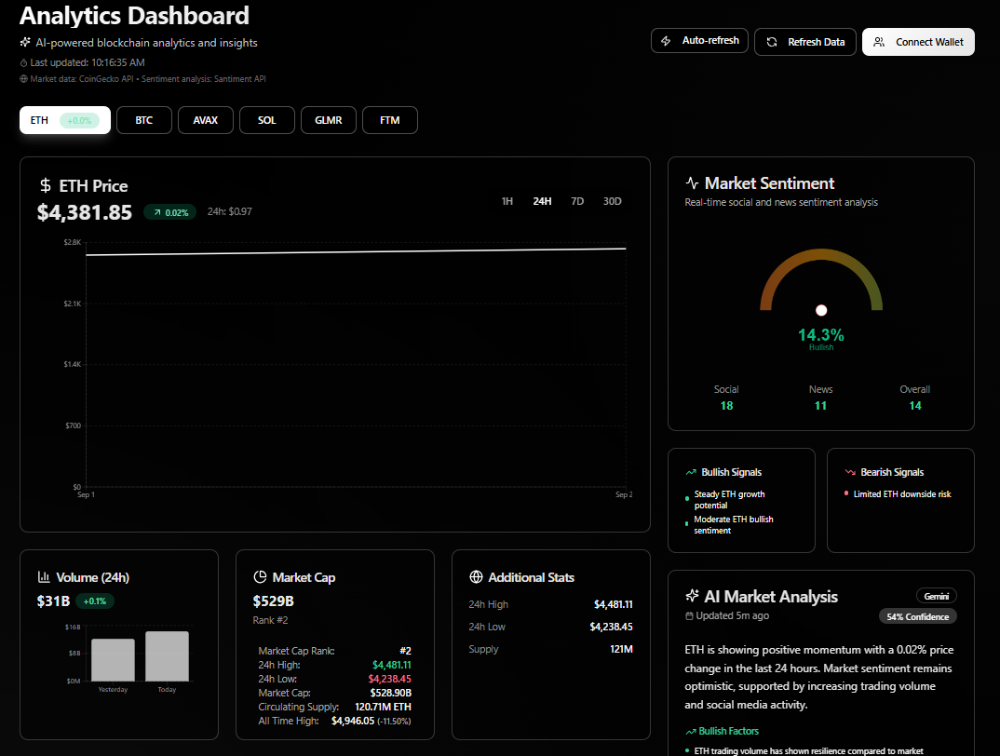

# NuroTrader Analytics Platform



NeuroTrader is an AI-powered cryptocurrency analytics platform that provides comprehensive market insights and features an integrated AI agent for blockchain analysis and interaction.

## 📋 Table of Contents

- [Features](#-features)
- [Project Structure](#-project-structure)
- [Setup and Installation](#-setup-and-installation)
- [Running the Application](#-running-the-application)
- [Using the Platform](#-using-the-platform)
- [AI Agent Integration](#-ai-agent-integration)
- [Technologies Used](#-technologies-used)
- [Documentation](#-documentation)

## ✨ Features

- **Interactive Analytics Dashboard**: Comprehensive market analytics with AI-powered insights
- **Advanced AI Chat Widget**: Enhanced markdown rendering, code highlighting, and expandable interface
- **Multi-Chain Support**: Compatible with major blockchains including Ethereum, Avalanche, and more
- **Real-Time Data**: Live market data, sentiment analysis, and trading insights
- **AgentKit Integration**: Seamless integration with AgentKit for powerful blockchain interactions

## 🗂 Project Structure

The project follows a standard React + Vite structure with a separate backend:

```
NeuroTrader/
├── backend/                  # Backend server and agent logic
│   ├── agent-server.cjs      # Express server for handling agent requests
│   └── agentkit/             # AgentKit integration and configuration
├── public/                   # Static files
├── src/                      # Frontend source code
│   ├── assets/               # Images and static resources
│   ├── components/           # Reusable React components
│   │   ├── AgentChatWidget.tsx  # Enhanced AI chat widget component
│   │   ├── AnalyticsHub.tsx     # Analytics dashboard component
│   │   └── ui/               # UI components from shadcn/ui
│   ├── hooks/                # Custom React hooks
│   ├── lib/                  # Utility functions
│   └── pages/                # Page components
├── vite.config.ts            # Vite configuration
└── package.json              # Project dependencies and scripts
```

## 🚀 Setup and Installation

1. **Clone the repository**
   ```bash
   git clone https://github.com/Jivan052/NeuroTrader.git
   cd NeuroTrader
   ```

2. **Install dependencies**
   ```bash
   npm install
   # or
   bun install
   ```

3. **Configure environment variables**
   - Create a `.env` file in the `backend/agentkit/` directory
   - Set up your AgentKit API keys and configuration:
   ```
   AGENTKIT_API_KEY=your_api_key_here
   MODEL_PROVIDER=openai
   MODEL_NAME=gpt-4o
   ```

4. **Install AgentKit CLI** (if not already installed)
   ```bash
   npm install -g @0xgasless/agentkit
   ```

## 🏃‍♂️ Running the Application

### Option 1: Using the convenience script (Windows)

Run the provided PowerShell script to start both frontend and backend:
```powershell
.\start-agent-app.ps1
```

### Option 2: Running services separately

1. **Start the frontend**
   ```bash
   npm run dev
   # or
   bun run dev
   ```

2. **Start the backend (in a separate terminal)**
   ```bash
   npm run agent
   # or
   bun run agent
   ```

The frontend will be accessible at http://localhost:5173  
The backend agent server will run at http://localhost:3002

## 💻 Using the Platform

1. **Analytics Dashboard**
   - Navigate to the main dashboard to see comprehensive market data
   - Explore charts, trends, and AI-powered insights
   - Use the filtering options to focus on specific tokens or time ranges

2. **AI Agent Interaction**
   - Use the chat widget in the bottom-right corner
   - Click the chat icon to expand the widget
   - Type your questions about blockchain data, market analysis, or token information
   - Toggle fullscreen mode for longer conversations

3. **Sample Queries for the AI Agent**
   - "What is the current price of Bitcoin?"
   - "Show me the top performing tokens this week"
   - "Analyze the sentiment for Ethereum in the last 24 hours"
   - "What's the gas price on Ethereum right now?"
   - "Explain the recent price movement of Avalanche"

## 🤖 AI Agent Integration

The AI agent is powered by AgentKit and features:

- **Enhanced Chat Widget**: Full markdown support, code highlighting, and responsive design
- **Fullscreen Mode**: Expanded view for detailed responses with keyboard shortcuts
- **Copy Functionality**: Easy copying of responses with visual feedback
- **Persistent Context**: Conversation context is maintained throughout the session
- **Blockchain Capabilities**: Direct access to on-chain data and analytics

### Chat Widget Features

- **Markdown Rendering**: Proper formatting of lists, tables, and code blocks
- **Syntax Highlighting**: Code snippets are rendered with proper syntax highlighting
- **Responsive Design**: Adapts to different screen sizes
- **Keyboard Shortcuts**: ESC to exit fullscreen mode
- **Visual Feedback**: Copy confirmation and loading indicators

## 🛠 Technologies Used

### Frontend
- **React 18** - UI library
- **TypeScript** - Type-safe JavaScript
- **Vite** - Next-generation frontend tooling
- **Tailwind CSS** - Utility-first CSS framework
- **shadcn/ui** - Reusable component system
- **Framer Motion** - Animation library
- **ReactMarkdown** - Markdown rendering
- **Recharts** - Charting library
- **React Router** - Navigation
- **TanStack Query** - Data fetching and caching

### Backend
- **Node.js** - JavaScript runtime
- **Express** - Web server framework
- **AgentKit** - AI agent framework
- **SQLite** - Lightweight database (for persistent storage)
- **dotenv** - Environment variable management

### Blockchain Integration
- **thirdweb** - Web3 development framework
- **viem** - Ethereum library
- **wagmi** - React hooks for Ethereum
- **ethers.js** - Ethereum wallet implementation

## 📚 Documentation

For detailed documentation about the NeuroTrader platform, please refer to the following resources:

- [Full Documentation](./docs/DOCUMENTATION.md) - Comprehensive guide to the platform
- [Component API Reference](./docs/DOCUMENTATION.md#component-documentation) - Details about component props and usage
- [Troubleshooting Guide](./docs/DOCUMENTATION.md#troubleshooting) - Solutions to common issues
- [Development Guide](./docs/DOCUMENTATION.md#development-guide) - How to extend and customize the platform

---

Built with ❤️ using [AgentKit](https://github.com/0xgasless/agentkit) | [GitHub Repository](https://github.com/Jivan052/NeuroTrader)

